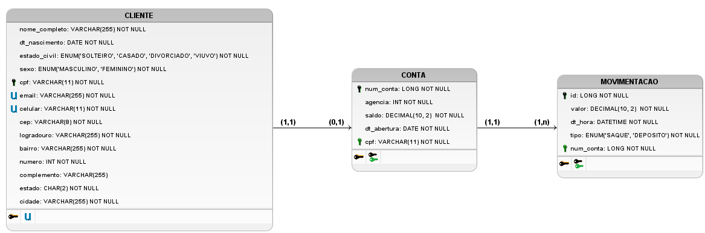

# Teste Técnico BTG Pactual

## Projeto do Banco de Dados

### Modelo Entidade-Relacionamento

#### Entidades
- CLIENTE
- CONTA
- MOVIMENTACAO

#### Atributos
- **CLIENTE**  (nome\_completo,  dt\_nascimento,  sexo,  estado\_civil,  cpf,  email, celular,  endereco  (cep,  logradouro,  bairro,  numero,  complemento,  estado, cidade))
- **CONTA** (num\_conta, agencia, saldo, dt\_abertura)
- **MOVIMENTACAO** (id, valor, dt\_hora, tipo)

#### Relacionamentos
- **CLIENTE** possui **CONTA**
Um **CLIENTE** possui ou não uma **CONTA**, e uma **CONTA** é possuída por apenas um **CLIENTE**
**(1, 0)**

- **CONTA** realiza **MOVIMENTACAO**
Uma **CONTA** pode realizar várias **MOVIMENTACOES**, e uma   **MOVIMENTACAO** pode ser feita apenas por uma **CONTA**
**(1, n)**

### Diagrama Entidade-Relacionamento

### Diagrama Lógico de Dados

Banco de dados utilizado: **MySQL 8.0**

Os scripts DDL e DML podem ser encontrados na pasta [docs/scripts](docs/scripts)

## API

### Descrição

API Desenvolvida em Java com o intuito de demonstrar o funcionamento do projeto de banco de dados. A aplicação está totalmente conteinerizada (Banco de dados + API), portanto é recomendado o uso do Docker para sua execução.

### Rodando o projeto

Para rodar o projeto, é necessário apenas a instalação do docker e docker-compose.

#### Comando
    docker-compose up --build

obs.: Ao executar o projeto pela primeira vez, o banco será criado e populado (todos os dados foram gerados no site [4devs](https://www.4devs.com.br/))
## REST API

### Cliente

#### Buscar lista de Clientes
**Request**
`GET /api/cliente`

    curl -i -H 'Accept: application/json' http://localhost:8080/api/cliente

#### Buscar Cliente existente
**Request**
`GET /api/cliente/cpf`

    curl -i -H 'Accept: application/json' http://localhost:8080/api/cliente/59514856147

#### Cadastrar um novo Cliente
**Request**
`POST /api/cliente/register`

    curl -X POST http://localhost:8080/api/cliente/register \
    -H 'Content-Type: application/json' \
    -d '{
          "nomeCompleto": "Teste",
          "dtNascimento": "1980-01-01",
          "sexo": "MASCULINO",
          "estadoCivil": "SOLTEIRO",
          "cpf": "99999999999",
          "email": "teste@email.com",
          "celular": "61999999999",
          "cep": "99999999",
          "logradouro": "Rua Teste",
          "bairro": "Teste",
          "complemento": "Teste",
          "numero": "1",
          "estado": "DF",
          "cidade": "Brasília"
	    }'

#### Editar um Cliente existente
**Request**
`PUT` /api/cliente/update

    curl -X PUT http://localhost:8080/api/cliente/update \
    -H 'Content-Type: application/json' \
    -d '{
          "nomeCompleto": "Teste1",
          "dtNascimento": "1981-01-01",
          "sexo": "MASCULINO",
          "estadoCivil": "CASADO",
          "cpf": "99999999999",
          "email": "teste5@email.com",
          "celular": "61899999998",
          "cep": "99999999",
          "logradouro": "Rua Teste",
          "bairro": "Teste",
          "complemento": "Teste",
          "numero": "1",
          "estado": "DF",
          "cidade": "Brasília"
	    }'

#### Deletar um Cliente existente
**Request**
`DELETE` /api/cliente/delete/cpf

    curl -i -H 'Accept: application/json' -X DELETE http://localhost:8080/api/cliente/delete/99999999999

### Conta

#### Buscar lista de Contas
**Request**
`GET` /api/conta

    curl -i -H 'Accept: application/json' http://localhost:8080/api/conta

#### Buscar Conta existente
**Request**
`GET` /api/conta/numConta

    curl -i -H 'Accept: application/json' http://localhost:8080/api/conta/1

#### Cadastrar nova Conta
**Request**
`POST` /api/conta/register

    curl -X POST http://localhost:8080/api/conta/register \
    -H 'Content-Type: application/json' \
    -d '{
            "agencia": 1234,
            "dtAbertura": "2021-12-30",
            "cpfCliente": "99999999999"
	    }'

#### Deletar uma Conta existente
**Request**
`DELETE` /api/conta/delete/numConta

    curl -i -H 'Accept: application/json' -X DELETE http://localhost:8080/api/conta/delete/7

### Movimentacao

#### Buscar lista de Movimentacoes de uma Conta
**Request**
`GET /api/movimentacao/numConta`

    curl -i -H 'Accept: application/json' http://localhost:8080/api/movimentacao/3

#### Cadastrar uma nova Movimentacao de uma Conta
**Request**
`POST /api/movimentacao/register/numConta`

    curl -X POST http://localhost:8080/api/movimentacao/register/3 \
    -H 'Content-Type: application/json' \
    -d '{
            "valor": 1000.25,
            "tipo": "SAQUE"
        }'
